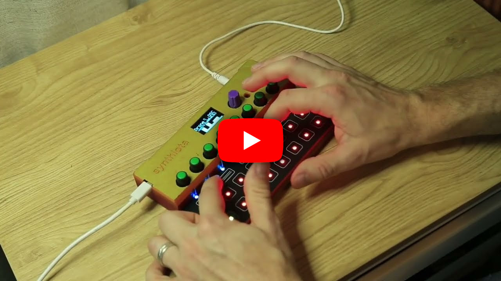

# Synthiota Drone Synthesizer
8-voice drone synthesizer written in CircuitPython for the [Synthiota](https://github.com/todbot/synthiota).

## Video Demonstration

[](https://youtu.be/6oZ6IUpAfgI?si=fsnmxTWXVVQDLwPw)

## Building CircuitPython Package
Ensure that you have python 3.x installed system-wide and all the prerequisite libraries installed using the following command:

``` shell
pip3 install circup requests
```

Download all CircuitPython libraries and package the application using the following command:

``` shell
python3 build/build.py
```

The project bundle should be found within `./dist` as a `.zip` file with the same name as your repository.
